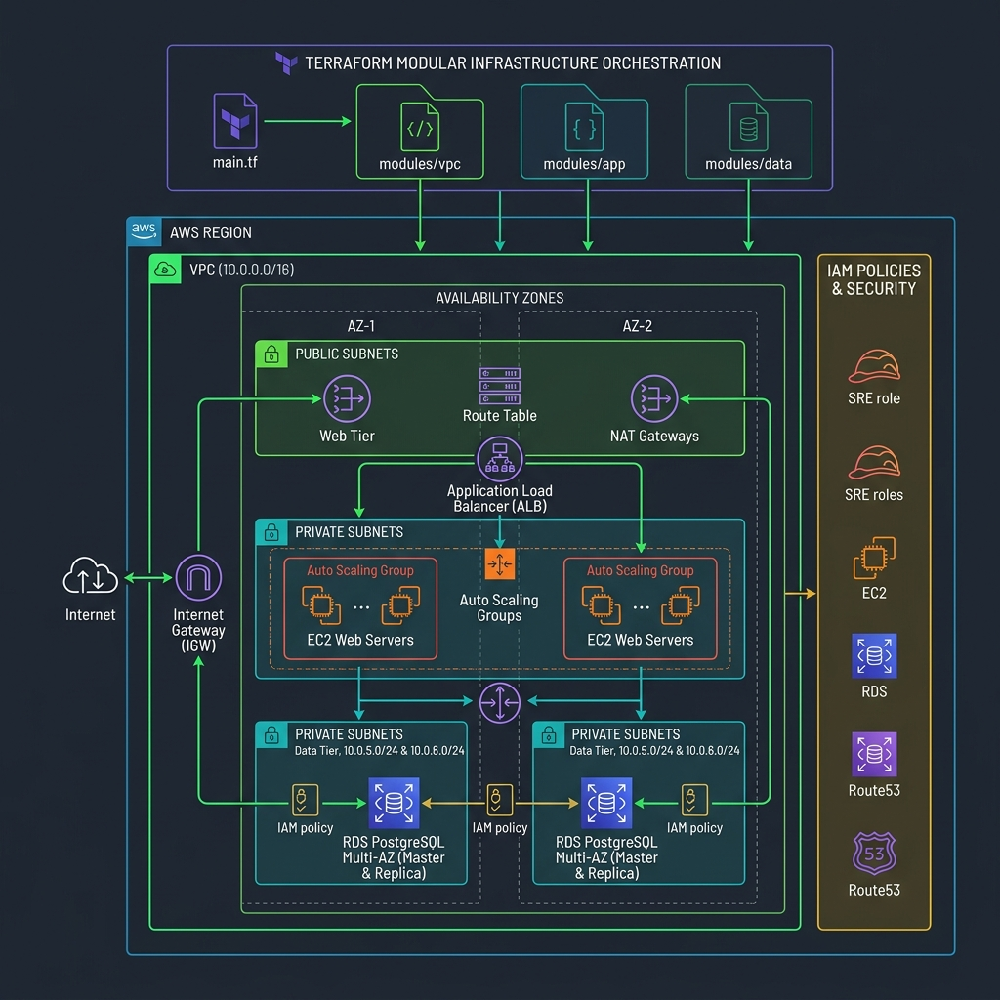

# 🌐 VPC Subnetting Calculator
> Slice CIDR blocks into optimized public and private subnets across multi-AZ configurations. Visualize real-time SVG network topologies with routing, NAT gateways, and export HCL/CLI blueprints.

[](https://pradeeptalari14.github.io/portfolio/tools/vpc-subnetter/)
[]()

---

## 🎛️ How This Studio Works

Slice CIDR blocks into optimized public and private subnets across multi-AZ configurations. Visualize real-time SVG network topologies with routing, NAT gateways, and export HCL/CLI blueprints.

Open the **[Interactive Studio](${studioUrl})** to configure options and generate files.
Each option combination produces different output — try different settings to learn by example.

## 🏗️ Architecture Flow Diagram



## 🔄 Workflow

```
1. Open Studio → https://pradeeptalari14.github.io/portfolio/tools/vpc-subnetter/
2. Configure all parameters (options change the generated output)
3. Review the live output in the editor tabs
4. Download or Copy the generated files
5. Place files in your project repository
6. Run the execution command shown in the studio
7. Validate with the verification command
```

## ⚡ Quick Start

```bash
git clone https://github.com/Pradeeptalari14/tp-vpc-subnetter.git
cd tp-vpc-subnetter
# Browse examples/ for reference configurations
```

## 🔐 Security

- ❌ Never commit real credentials
- ✅ Use environment variables or secret managers
- ✅ Enable branch protection on `main`

## 📖 Resources

| Resource | Link |
|----------|------|
| Interactive Studio | [Open →](https://pradeeptalari14.github.io/portfolio/tools/vpc-subnetter/) |
| All 91 Studios | [Dashboard →](https://pradeeptalari14.github.io/portfolio/tools/) |

*Part of [Talari Pradeep Developer Studio Portfolio](https://pradeeptalari14.github.io/portfolio)*